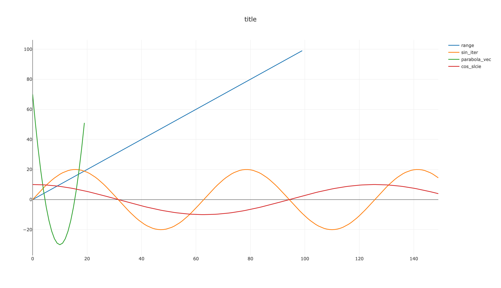

# simple-plot

[](https://crates.io/crates/simple-plot)
[](https://docs.rs/simple-plot)


Provides a macro plot!() that plots a one-dimensional vector (`impl IntoIterator<Item={number}>`) using Plotly. 

There is no need for complicated settings; simply pass to plot!() the title of the graph and the vectors you wish to plot, and the graph will be displayed. 

The passed vector is plotted with index on the x-axis and elements as values on the y-axis.

## Usage/Examples
In Cargo.toml
```
[dependencies]
simple-plot = "0.1.0"
```
```rust
let range = 0..100;
let sin_iter = (0..150).map(|x| (x as f32 / 10.0).sin() * 20.0);
let parabola_vec:Vec<i32> = (-10..10).map(|x| x*x - 30).collect();
let cos_vec: Vec<f32> = (0..150).map(|x| (x as f32 / 20.0).cos() * 10.0).collect();
let cos_slcie: &[f32] = &cos_vec;

simple_plot::plot!("title", range, sin_iter, parabola_vec, cos_slcie);
```
Result


## What this library cannot do 
- Changing the value of the x-axis
- Changing the color of a graph
etc.

If you need these functions, use [plotly](https://crates.io/crates/plotly) 
